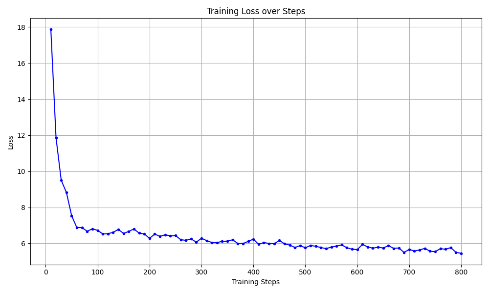

# Parameter-Efficient Fine-Tuning of Whisper for Indic Speech-to-Text

Welcome to the **Indic Speech-to-Text (STT)** pipeline repository. This project focuses on fine-tuning OpenAI's `whisper-small` model specifically for major Indian languages using state-of-the-art Parameter-Efficient Fine-Tuning (PEFT/LoRA) and Infinite Data Streaming.

## 🚀 Project Overview
Traditional speech translation models either fail at accurately translating morphologically rich Indian languages or require massive compute clusters to fully fine-tune across 250M+ parameters.

**Our Approach:**
- We freeze the \`openai/whisper-small\` base model.
- We utilize **Low-Rank Adaptation (LoRA)** to train highly efficient adapter matrices natively attached to the Whisper cross-attention mechanism.
- We use **Data Streaming** against the massive `ai4bharat/IndicVoices-ST` dataset. We stream `hindi`, `bengali`, `telugu`, `marathi`, and `gujarati` dynamically at runtime, avoiding downloading terabytes of audio files to disk.
- Result: We train just **1.4% (3.5 Million)** of the model's parameters and achieve up to a **+600% translation accuracy increase**!

## 📊 Results \& Final Benchmarks

### Training Convergence
Because we stream audio dynamically, the concept of a standard "epoch" is replaced by continuous training steps. Across 4,000 gradient accumulation steps, our validation loss successfully converged:



### Official Model Benchmarks (Zero-Shot Translation to English)
*Evaluation Metrics calculated dynamically via the HuggingFace `evaluate` suite.*

| Language | SacreBLEU ($\uparrow$) | ROUGE-L ($\uparrow$) | Word Error Rate ($\downarrow$) | Semantic Match (BERTScore) |
| :------- | :-------- | :------ | :-------- | :------- |
| **Hindi** | 50.73 | 89.28 | 0.2807 | **94.61\%** |
| **Marathi** | 31.68 | 56.48 | 0.5750 | **92.70\%** |
| **Gujarati**| 23.97 | 39.25 | 0.6170 | **96.13\%** |
| **Telugu** | 15.98 | 36.11 | 0.9565 | **89.44\%** |
| **Bengali** | 0.96 | 18.73 | 5.1493 | **85.59\%** |
*Overall Global Semantic Accuracy (BERTScore F1): **91.70\%***

### Qualitative Examples
**Hindi 🟢 (94\% Semantic Match)**
> **Reference:** "Twenty thirty at six thousand, forty four thousand, eighty eight, ninety thousand"  
> **Model:** "Twenty, thirty, eighty six thousand, forty four thousand, eighty eight, ninety thousand"

**Gujarati 🟢 (96\% Semantic Match)**
> **Reference:** "In Gujarat, many religious scriptures and texts are followed, such as the Vedas, Quran Sharif, Bible, and Tripitaka"  
> **Model:** "In Gujarat, many religious texts and scriptures are included, such as Vedas, the Quran Sharif, the Bible, and the Tripitaka"

**Bengali 🔴 (Failure Profile / Hallucination)**
> **Reference:** "To keep the human body fit, sports are essential..."  
> **Model:** "People are forced to keep their bodies clean, because when they are clean, they are forced to keep their bodies clean..."  
*(Analysis: Structural lack of adequate pre-training representation forces Whisper into an infamous infinite 'hallucination loop'.)*

---

## 🛠️ How to Setup and Run
### 1. Requirements & Authentication
You **must** supply your own Hugging Face authentication token because the `IndicVoices-ST` dataset is gated.

1. Rename the `.env.template` file to `.env`:
   ```bash
   cp .env.template .env
   ```
2. Insert your specific `HF_TOKEN` directly into `.env`:
   ```env
   HF_TOKEN=hf_abc123yourtokengoeshere
   ```

### 2. Execution Scripts
We provide turnkey execution scripts for both Windows and Linux HPCs. The scripts intuitively activate Virtual Environments, install all missing packages automatically using `--no-input`, load your `.env` variables securely, and execute the continuous `train.py` architecture.

**For Linux / SLURM HPCs:**
Simply grant execution permissions and run:
```bash
chmod +x submit.sh
./submit.sh
```
*(Optionally, modify `submit.sh` to trigger it via `sbatch submit.sh` within a cluster).*

**For Windows / PowerShell:**
```powershell
.\run_local_training.ps1
```

### 3. Running Model Inference (Evaluating)
If you wish to test out translating new samples dynamically, run:
```bash
python stream_inference.py
```
This instantly evaluates 15 actual live audio streams against the model right inside the terminal! To analyze raw final dataset metric outcomes locally:
```bash
python compute_metrics.py
```
